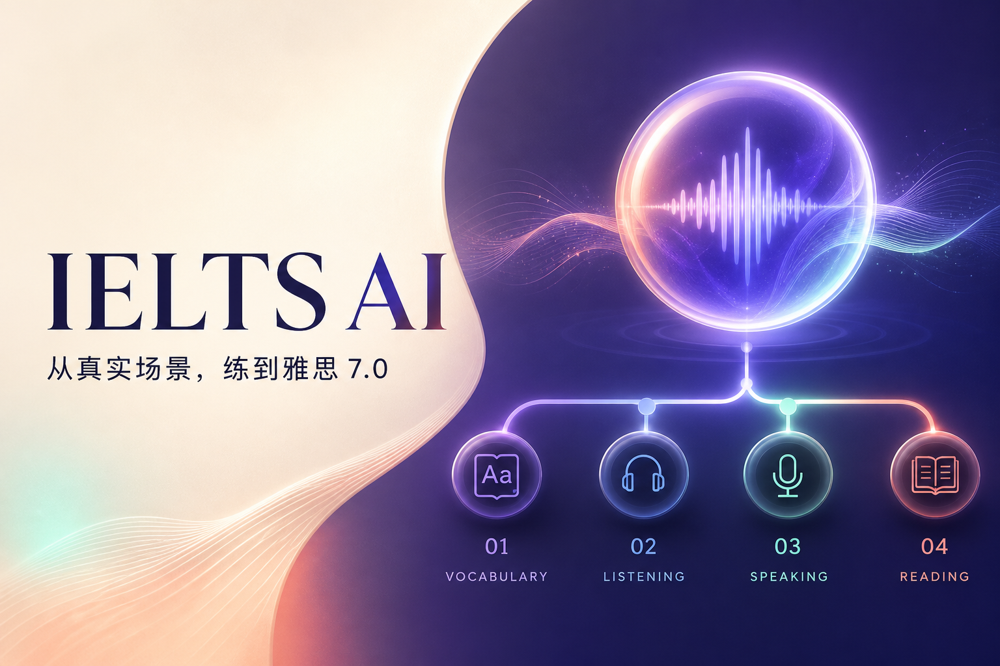

<p align="center">
  
</p>

<h1 align="center">IELTS Pass</h1>

<p align="center">
  一款以真实场景串联词汇、听力、口语和阅读的跨端雅思学习应用。
  <br />
  手机随时学，电脑深度练；每次错误都会回到下一次复习。
</p>

<p align="center">
  
  
  
  
</p>

## 为什么做这个产品

多数雅思工具把词汇、听力、口语和阅读拆成四座孤岛。IELTS Pass 采用另一条路径：让同一个真实场景贯穿四项能力，并把练习结果统一进入进度与复习系统。

例如在「第一次在英国租房」场景中，用户会依次：

1. 先用 5 × 20 的节奏快速眼熟 100 个雅思高频词，再听写 `deposit`、`furnished`、`utilities` 等场景核心词。
2. 精听一段租房咨询并完成题目。
3. 进入 Speaking Part 3，与 AI 考官围绕住房与城市进行更抽象的双向讨论。
4. 阅读原创 Academic Passage，完成段落标题匹配、信息匹配、单选、判断与摘要填空。
5. 自动复习本次答错的单词和表达。

## 当前可以测试什么

- **场景学习路径**：词汇 → 听力 → 口语 → 阅读。
- **每日 100 词**：100 个雅思高频词分成 5 组快速辨认，自动保存当日进度。
- **分层记忆**：先判断“认识/还不熟”，不熟词自动回流复习，避免第一次学习就被强制听写拖慢。
- **电脑打字记词**：听音拼写、Enter 检查、提示、例句发音。
- **内置听力练习**：英式语音播放、单选题、原文与解析。
- **口语 Part 3 模拟**：考官式连续提问、4–5 分钟结构、短回答追问和展开提示。
- **Academic Reading 套题**：原创长文配段落标题匹配、信息匹配、单选、判断和摘要填空，共 11 题。
- **进度激励**：今日完成度、连续学习、本周时长、各项完成状态。
- **记忆回流**：词汇错误自动进入复习，掌握后可以移出。
- **本地持久化**：刷新浏览器后保留学习记录。
- **响应式布局**：同一套功能适配手机与电脑，但使用不同信息布局。

> 当前考官回复和回答展开提示使用可替换的本地逻辑，目的是在没有 API 密钥时也能测试考试流程；它不会冒充官方 IELTS 评分。正式 AI 模型、账号和跨设备云同步属于下一阶段。

## 本地运行

### 环境要求

- Node.js `>= 22.13.0`
- npm `>= 10`
- 推荐使用 Chrome 测试语音识别

### 启动开发版本

```bash
git clone git@github.com:shuhuihuang0704/IELTS-Pass.git
cd IELTS-Pass
npm install
npm run dev
```

打开 [http://localhost:3000](http://localhost:3000)。

### 验证质量

```bash
npm test
npm run lint
npm run build
```

## 推荐测试路线

1. 在首页点击「每日高频词」，翻开词义并分别标记“认识”和“还不熟”。
2. 确认首页显示今日词汇进度，标记为不熟的词进入「复习」。
3. 切换到「场景听写」，输入错误和正确单词，确认 Enter 可以提交。
4. 切换到听力，播放录音并提交答案。
5. 切换到口语 Part 3，用文字或麦克风回答考官；先提交一个很短的回答，检查考官追问，再提交完整回答。
6. 完成阅读的 11 道混合题型，查看每题正误和总分。
7. 刷新页面，确认进度仍然存在。
8. 缩小浏览器宽度，检查手机端底部导航和练习布局。

## 技术结构

```text
app/
├── IeltsApp.tsx        # 应用导航、四项练习与进度交互
├── learning-data.ts    # 场景语料、题目和词汇
├── learning-state.ts   # 学习状态、持久化合并与完成度计算
├── globals.css         # 跨端视觉系统与响应式布局
├── layout.tsx          # 产品元数据与分享卡片
└── page.tsx            # 应用入口

tests/
└── rendered-html.test.mjs
```

技术栈：React 19、TypeScript、vinext、Vite、Cloudflare Workers / Sites。

## 产品原则

- **真实进度，不制造虚假成长**：能力变化必须来自已完成的练习。
- **AI 服务学习闭环**：AI 用于互动、反馈和个性化，不替代可靠内容。
- **跨端但不简单放大**：手机强调随时学习，电脑强调键盘和完整做题。
- **错误是学习资产**：错词、错句和错题必须能够再次出现。
- **内容与模型解耦**：未来更换 AI 服务时，不重做学习流程和数据结构。

## Roadmap

- [x] 响应式应用外壳与品牌视觉
- [x] 租房场景的词汇、听力、口语、阅读闭环
- [x] 每日 100 个雅思高频词、5 × 20 分组进度和错词回流
- [x] Academic Reading 混合题型与 Speaking Part 3 考官式讨论
- [x] 进度激励和浏览器本地持久化
- [x] 自动构建测试与社交分享封面
- [ ] 接入真实 AI 对话与结构化口语反馈
- [ ] 用户登录与手机、电脑进度同步
- [ ] 扩充雅思题型和人工审核场景语料
- [ ] 模考、写作与能力趋势报告
- [ ] 小范围真实用户测试和订阅体系

更完整的分阶段计划见 [PRODUCT_PLAN.md](./PRODUCT_PLAN.md)。

## 数据与隐私

当前 MVP 不上传录音或学习数据。进度存储在浏览器 `localStorage` 中，用户可以在「我的」页面随时重置。接入云端和真实 AI 前，需要补充明确的隐私政策、数据保留期限和删除机制。

---

<p align="center">
  <strong>IELTS Pass</strong><br />
  Learn one scene. Build four skills.
</p>
